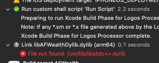
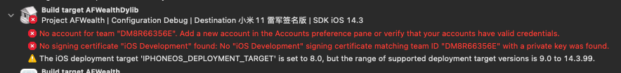
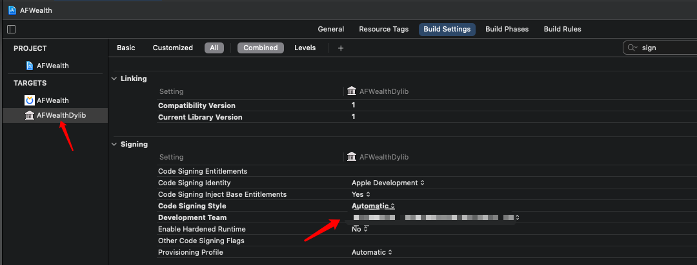

# AFWealthTest
给蚂蚁财富增加预览统计功能

# Prepare

需要一份砸壳后的 ipa

安装 [MonkeyDev](https://github.com/AloneMonkey/MonkeyDev/wiki/%E5%AE%89%E8%A3%85)

## 可能遇到的问题
---

[没有找到 libstdc++](https://github.com/devdawei/libstdc-)

---

# About
免责声明，本代码仅用于学习，下载后请勿用于商业用途

# Use
将蚂蚁财富的ipa包放入TargetApp下 运行即可

注意：需要删除原有的 App

# 懒人
[友情链接](https://github.com/iOSleep/AFWealth)
